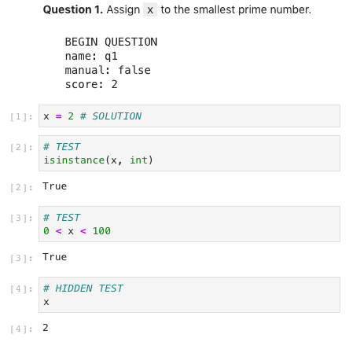

# Creating Notebooks with Embedded Tests

The following specification for embedding tests into a Jupyter notebook has the
following characteristics:

1. Each test is a cell with the expressions or statements to be evaluated. The
   expected output of the test is the output of the cell.
2. Tests are grouped into questions, and each question has associated metadata
   such as the question name and number of points.
3. Metadata about questions and assignments are expressed within notebook cells
   in YAML.

This format is designed for easy assignment authoring. Typically, a notebook in this format will be converted to the [OK format](ok-test-format.md) before it is distributed to students.

## Questions

An example question within a notebook:

A question is a description *Markdown* cell, followed by a response cell, followed by zero or more test *Code* cells. The description cell must contain a code block (enclosed in triple backticks) that begins with a `BEGIN QUESTION` header line, followed by YAML that defines metadata associated with the question.

The rest of the code block within the description cell must be YAML-formatted with the following fields (in any order):

* name (required) - a string identifier that is a legal file name.
* manual (optional) - a boolean (default False); whether to include the response cell in a PDF for manual grading.
* points (optional) - a number (default 1); how many points the question is worth.

The response cell must always appear directly below the description cell (where the question metadata is defined) and contain a correct response, along with annotations describing how the cell should be presented to students. **TODO(denero) specify solution stripping.**

The test cells are any code cells following the response cell that begin with a comment containing either the capitalized word `TEST` or `HIDDEN TEST`. A `TEST` is distributed to students so that they can validate their work. A `HIDDEN TEST` is not distributed to students, but is used for scoring their work.

## Assignment Metadata

Metadata can be provided about the assignment as a whole in a code block (enclosed in triple backticks) that begins with a `BEGIN ASSIGNMENT` header line, followed by YAML that defines metadata. **TODO specify legal assignment metadata (e.g., what course this assignment is for)**

## More info

**TODO pointers to docs on how to distribute assignments to students, configure autograders, etc.**