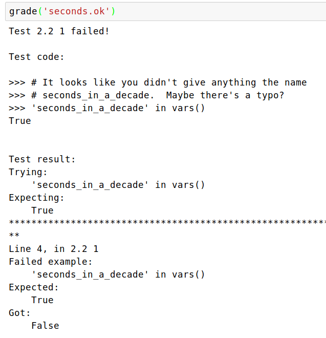
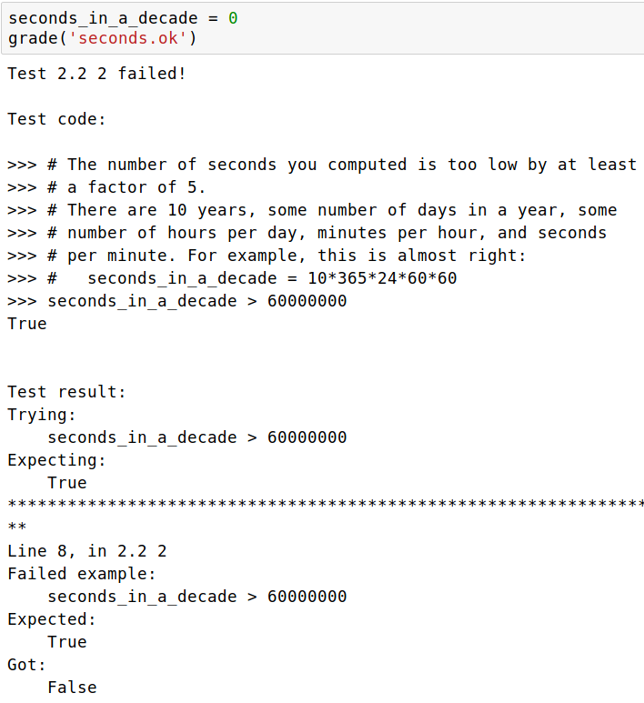
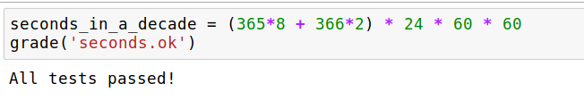

# Writing OK Tests

We implement a specific subset of OK Tests that instructors
can write. It doesn't have all the features that okpy has, but
tries to be compatible wherever possible.

An OK Test should be a valid python file that assigns a dictionary
to a global variable named `test`. Let's explore this more with an
example.

## Structure

```python
test = {
    'name': 'some-test',
    'suites': [
        {
            'cases': [
                {
                    'code': r"""
                    >>> # This is a doctest!
                    >>> len(some_variable) == 4
                    True
                    """
                },
                {
                    'code': r"""
                    >>> # This is another doctest.
                    >>> # This will run if the previous doctest passed
                    >>> some_variable == "yeah"
                    True
                    """
                }
            ]
        }
    ]
}
```

## Name

Name of this series of tests that is shown to students when it passes / fails.

## Suites

This should always be a list with a single item. The single item must
be a dictionary with the single key `cases` where the value is a list of
**test cases**.

Each **test case** is a dictionary, with one key `code`, and the value is
a test in [doctest](https://docs.python.org/3.6/library/doctest.html) format.
There can be any number of test cases - these will be run sequentially until
one of them fails. If all the test cases pass, a grade of `1` is assigned
for this particular oktest.

## Example

Lets' walk through an example!

We want our students to find the total number of seconds in a decade &
assign it to the variable `seconds_in_a_decade`. We want to progressively
test this, offering clues wherever they had failed.

Here's an ok test file, with 4 test cases:

```python
test = {
  'name': '2.2',
  'suites': [
    {
      'cases': [
        {
          'code': r"""
          >>> # It looks like you didn't give anything the name
          >>> # seconds_in_a_decade.  Maybe there's a typo?
          >>> 'seconds_in_a_decade' in vars()
          True
          """
        },
        {
          'code': r"""
          >>> # The number of seconds you computed is too low by at least
          >>> # a factor of 5.
          >>> # There are 10 years, some number of days in a year, some
          >>> # number of hours per day, minutes per hour, and seconds
          >>> # per minute. For example, this is almost right:
          >>> #   seconds_in_a_decade = 10*365*24*60*60
          >>> seconds_in_a_decade > 60000000
          True
          """
        },
        {
          'code': r"""
          >>> # You're close! Perhaps you didn't account for leap years correctly.
          >>> # There were 2 leap years and 8 non-leap years in this period.
          >>> # Leap years have 366 days instead of 365.
          >>> 315360000 < seconds_in_a_decade < 331344000
          True
          """
        },
        {
          'code': r"""
          >>> seconds_in_a_decade == 315532800
          True
          """
        }
      ]
    }
  ]
}
```

This ok test is in a file called `seconds.ok`.

In a Jupyter Notebook, let's try to perform this task!

First, we don't define this variable at all, and grade ourselves.



The grader runs tests sequentially, and whenever a test fails a
summary about it is displayed. The very first test failed here,
so it is displayed - including the comments that act as hints.



The second test has failed, and provides a hint too!

We now make an actual attempt at solving the problem, using the
hint.


Very close! There's also a hint here about how we are wrong...



w00t! All of our tests have passed!
